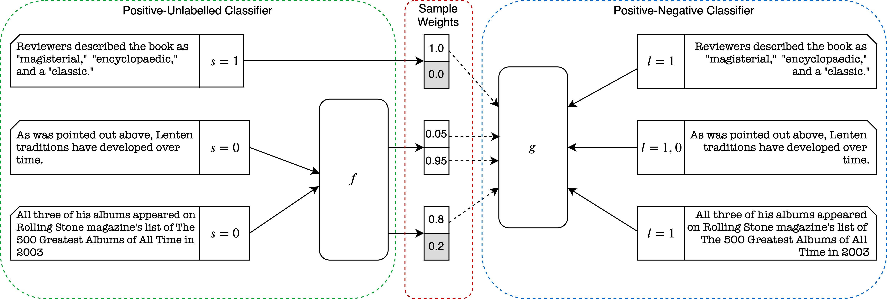

# Claim Check-Worthiness Detection as Positive Unlabelled Learning
Dustin Wright and Isabelle Augenstein

To appear in Findings of EMNLP 2020. Read the preprint: https://arxiv.org/abs/2003.02736

<p align="center">
  
</p>

A critical component of automatically combating misinformation is the detection of fact check-worthiness, ie determining if a piece of information should be checked for veracity. There are multiple isolated lines of research which address this core issue: check-worthiness detection from political speeches and debates, rumour detection on Twitter, and citation needed detection from Wikipedia. What is still lacking is a structured comparison of these variants of check-worthiness, as well as a unified approach to them. We find that check-worthiness detection is a very challenging task in any domain, because it both hinges upon detecting how factual a sentence is, and how likely a sentence is to be believed without verification. As such, annotators often only mark those instances they judge to be clear-cut check-worthy. Our best-performing method automatically corrects for this, using a variant of positive unlabelled learning, which learns when an instance annotated as not check-worthy should in fact have been annotated as being check-worthy. In applying this, we outperform the state of the art in two of the three domains studied for check-worthiness detection in English.

# Citing

```bib
@inproceedings{wright2020claim,
    title={{Claim Check-Worthiness Detection as Positive Unlabelled Learning}},
    author={Dustin Wright and Isabelle Augenstein},
    booktitle = {Findings of EMNLP},
    publisher = {Association for Computational Linguistics},
    year = 2020
}
```

# Recreating Results

The code is currently being prepared and will be released shortly.
